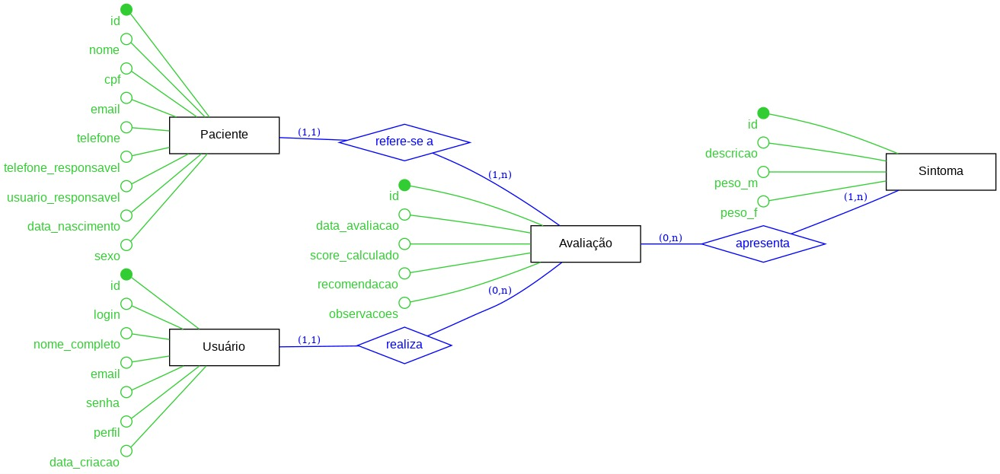
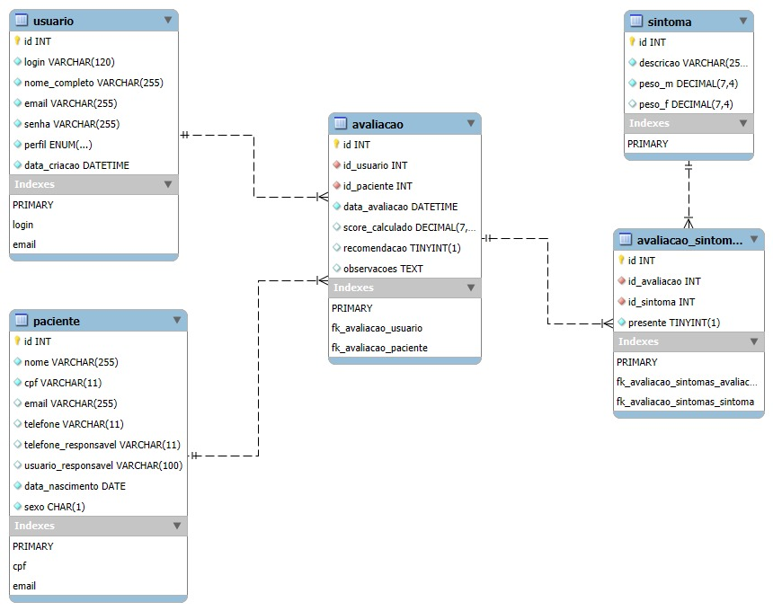

# Documentação do Banco de Dados — Trix

Este documento descreve como o banco de dados do Trix foi modelado, do mais abstrato ao mais concreto. São três visões do mesmo banco: o modelo conceitual, o lógico e o físico. A ideia é mostrar o raciocínio por trás das tabelas, e não só o resultado final.

O sistema gira em torno de quatro coisas: os usuários que operam o sistema, os pacientes que passam pela triagem, as avaliações (cada triagem feita) e os sintomas que entram no cálculo do score.

## Modelo Conceitual

O modelo conceitual é a visão mais alta. Ele mostra as entidades e como elas se relacionam, sem se preocupar ainda com tipos de dado ou detalhes de banco.

As quatro entidades são:

- **Usuário**: quem acessa o sistema, podendo ser administrador ou funcionário da saúde.
- **Paciente**: a pessoa avaliada na triagem.
- **Avaliação**: uma triagem realizada, com o score calculado e a recomendação.
- **Sintoma**: cada item do checklist clínico, com o seu peso.

Os relacionamentos funcionam assim:

- Um **Usuário** realiza várias **Avaliações**, mas cada avaliação foi feita por um único usuário.
- Um **Paciente** pode ter várias **Avaliações** ao longo do tempo, e cada avaliação se refere a um único paciente.
- Uma **Avaliação** apresenta vários **Sintomas**, e um mesmo sintoma aparece em várias avaliações. Esse é um relacionamento de muitos para muitos.

## Modelo Lógico

No modelo lógico as entidades viram tabelas, agora com os atributos, as chaves primárias e as chaves estrangeiras. A diferença mais importante em relação ao conceitual está no relacionamento de muitos para muitos entre Avaliação e Sintoma. Esse tipo de ligação não pode ser representado direto entre duas tabelas, então ele vira uma tabela no meio, a `avaliacao_sintomas`. Cada linha dela liga uma avaliação a um sintoma e guarda se aquele sintoma estava presente naquela triagem.

Ficaram cinco tabelas:

- `usuario` e `paciente` guardam os dados de cada um.
- `avaliacao` aponta para o usuário que fez a triagem (`id_usuario`) e para o paciente avaliado (`id_paciente`), além de guardar a data, o score e a recomendação.
- `sintoma` tem a descrição e os dois pesos, um para o sexo masculino e outro para o feminino.
- `avaliacao_sintomas` é a tabela do meio, que resolve o muitos para muitos entre avaliação e sintoma.

## Modelo Físico

O modelo físico é a implementação de verdade, escrita em SQL para o MySQL. É aqui que cada coluna ganha um tipo (`VARCHAR`, `DECIMAL`, `DATE` e por aí vai), as chaves estrangeiras ganham as regras de atualização e exclusão, e o banco é criado com suporte a acentuação (utf8mb4).

O DDL completo está no arquivo [`database/schemas.sql`](database/schemas.sql).

Alguns pontos que valem ser citados:

- O `perfil` do usuário é um `ENUM('administrador', 'medico')`, então só esses dois valores são aceitos.
- Os pesos dos sintomas e o score usam `DECIMAL(7,4)`, para não perder as casas decimais.
- O `sexo` do paciente é um `CHAR(1)` com uma checagem que só deixa passar 'M' ou 'F'.
- Quando uma avaliação é apagada, as linhas dela em `avaliacao_sintomas` são apagadas junto (ON DELETE CASCADE), para não sobrar registro solto.

Para montar o banco do zero, os scripts da pasta `database/` devem ser rodados nesta ordem: primeiro `setup_banco.sql`, depois `schemas.sql` e por fim `inserts.sql`.
